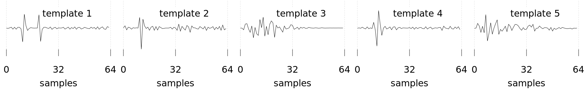
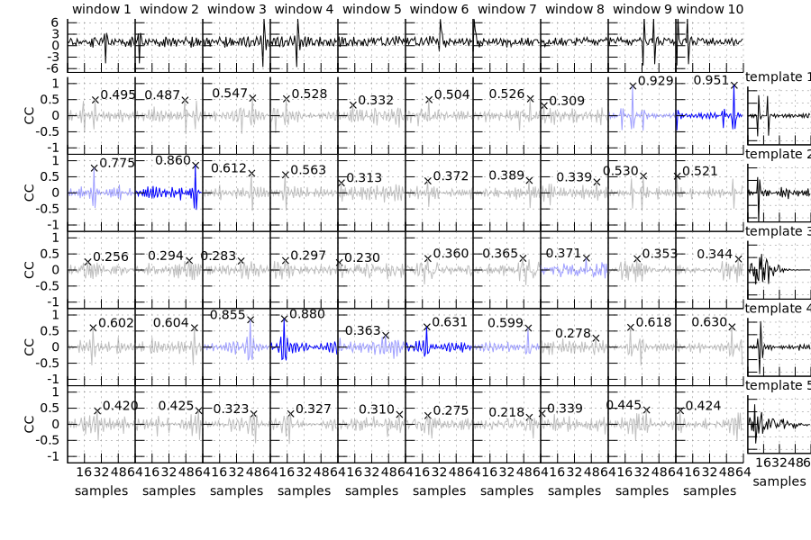

# *DiallelX*: Seismic network cross-correlation calculator

<address><a href="https://interfacial.jp/">Shiro Hirano</a></address>

<!--img src="https://img.shields.io/badge/-bash-00E599.svg">


Table of Contents

- [*DiallelX*: Seismic network cross-correlation calculator](#diallelx-seismic-network-cross-correlation-calculator)
  - [Summary](#summary)
  - [Installation](#installation)
    - [1. Install `gfortran` and `libfftw3-dev`](#1-install-gfortran-and-libfftw3-dev)
    - [2. Install Intel oneAPI Base Toolkit and Intel HPC Toolkit](#2-install-intel-oneapi-base-toolkit-and-intel-hpc-toolkit)
    - [3. Use Intel Fortran Compiler Classic (`ifort`) that is deprecated and no longer distributed](#3-use-intel-fortran-compiler-classic-ifort-that-is-deprecated-and-no-longer-distributed)
  - [Preparing data files: nomenclature](#preparing-data-files-nomenclature)
    - [Continuous waveform records](#continuous-waveform-records)
    - [Template waveforms](#template-waveforms)
  - [Algorithm: an overview](#algorithm-an-overview)
  - [Diallel calculation](#diallel-calculation)
  - [Interpretation of results](#interpretation-of-results)
    - [Event candidates](#event-candidates)
    - [histogram.dat](#histogramdat)
  - [Appendix A: Visual example of a diallel](#appendix-a-visual-example-of-a-diallel)
  - [Appendix B: Details of algorithm](#appendix-b-details-of-algorithm)


## Summary

*DiallelX* is a CPU-oriented modern fortran program to approximate Network Cross-Correlation coefficients (NCCs) among multiple continuous records and template waveforms observed at multiple seismic stations.
The results, relatively less accurate but sufficient to find new seismic events, are obtained several-fold faster than a conventional scheme.

Required steps are as follows:

0. Install *DiallelX* (gfortran and single-precision FFTW3 are required)
0. Prepare waveform records in float32 binary formats (w/o record boundaries) or SAC format
0. Run `./DiallelX -d [IOdirname]`
0. Define new events based on results and stats

Apropos, *DiallelX* is derived from a terminology of genetics as follows<sup>[[Hayman 1954]](https://doi.org/10.1093/genetics/39.6.789)</sup>:
> A *diallel cross* is the set of all possible matings between several genotypes.

Therefore, the term *diallel* in this context represents the set of cross-correlation coefficients (or functions) between all possible pairs of the continuous and template waveforms.

## Installation

Just running `make` under the `DiallelX` directory compiles the program.
However, other tools must have been installed before `make`.
Users have three installation options (the first is recommended, given official deprecation of `ifort` as in the third):

1. Install `gfortran` and `fftw3`
1. Install [Intel oneAPI Base Toolkit](https://www.intel.com/content/www/us/en/developer/tools/oneapi/base-toolkit-download.html) and [Intel HPC Toolkit](https://www.intel.com/content/www/us/en/developer/tools/oneapi/hpc-toolkit-download.html)
1. Use [Intel Fortran Compiler Classic](https://www.intel.com/content/www/us/en/developer/articles/guide/porting-guide-for-ifort-to-ifx.html) (`ifort`) that is deprecated and no longer distributed

Here is the installation guide for Linux Mint 21.x (the development environment of *DiallelX*), Ubuntu 22.04, and AlmaLinux 9.3 <!--macOS Sonoma-->.

[!WARNING]
(2024-06-09)
After upgrading to ifort Version 2021.12.0 Build 20240211_000000

### 1. Install `gfortran` and `libfftw3-dev`

For Ubuntu (`make` has not been installed by default) or Linux Mint:
```bash
$ sudo apt install make gfortran libfftw3-dev -y
```

For AlmaLinux:
```bash
$ sudo dnf install gfortran fftw3-devel -y 
```
<!--
For macOS Sonoma:
```bash
$ brew install gcc fftw
```
-->

### 2. Install [Intel oneAPI Base Toolkit](https://www.intel.com/content/www/us/en/developer/tools/oneapi/base-toolkit-download.html) and [Intel HPC Toolkit](https://www.intel.com/content/www/us/en/developer/tools/oneapi/hpc-toolkit-download.html)

For Linux Mint/Ubuntu, the following procedures are provided in the above two links:
```bash
$ wget -O- https://apt.repos.intel.com/intel-gpg-keys/GPG-PUB-KEY-INTEL-SW-PRODUCTS.PUB \ | gpg --dearmor | sudo tee /usr/share/keyrings/oneapi-archive-keyring.gpg > /dev/null
$ echo "deb [signed-by=/usr/share/keyrings/oneapi-archive-keyring.gpg] https://apt.repos.intel.com/oneapi all main" | sudo tee /etc/apt/sources.list.d/oneAPI.list
$ sudo apt update
$ sudo apt install intel-basekit intel-hpckit -y
```

After these installations, running
```bash
$ echo "source /opt/intel/oneapi/setvars.sh > /dev/null" >> ~/.bashrc
```
is required to set environment variables.

The same option is unavailable for macOS because of [the official announcement](https://www.intel.com/content/www/us/en/docs/oneapi/installation-guide-macos/2024-0/overview.html):
>  NOTE: Starting with the 2024.0 release, macOS* is no longer supported in Intel® oneAPI Toolkits and components.

### 3. Use [Intel Fortran Compiler Classic](https://www.intel.com/content/www/us/en/developer/articles/guide/porting-guide-for-ifort-to-ifx.html) (`ifort`) that is deprecated and no longer distributed

Intel Fortran Compiler Classic (`ifort`) may provide the fastest executable file of *DiallelX*.
However, `ifort` says:
> Intel(R) Fortran Compiler Classic (ifort) is now deprecated and will be discontinued late 2024. Intel recommends that customers transition now to using the LLVM-based Intel(R) Fortran Compiler (ifx) for continued Windows* and Linux* support, new language support, new language features, and optimizations.

At least for Jan. 2024, unfortunately, `ifx` provides a significantly slower executable file than `ifort` and `gfortan` does.
Therefore, `Makefile` of *DiallelX* uses `ifort` if available.

## Preparing data files: nomenclature

Here is an example of the nomenclature of waveform files.
Input waveforms must be SAC or float32 binary files w/o record boundaries.
In the following, ".sac" can be replaced by ".bin".
Inside of the brackets [ &nbsp; ] can be defined by the user.
All data files are assumed to be in subdirectories under `[IOdirname]`, whose name is arbitrary and to be specified by the user when `./DiallelX` is executed.

### Continuous waveform records

All continuous records must consist of the same length.
For example, a daily record with 100 Hz sampling rate results in 100 $\times$ 60 $\times$ 60 $\times$ 24 = 8,640,000 samples, which is 34,560,000 Bytes for a float32 binary file or 34,560,632 Bytes for a SAC file.

Users have to place continuous records in `[IOdirname]/continuous_records/`, where the file names are assumed to be `[RecordID]_[ChannelID].sac`.

`[RecordID]` is IDs of each continuous record; e.g., hourly, daily, weekly, etc. However, monthly-long data are not suitable due to their different lengths.
Note that too long (e.g., 100 Hz yearly) data per file is not acceptable because the number of samples for each file is represented by int32, and its maximum is $2^{31}-1 = 2,147,483,647$.
The record IDs must be free of underscore ( _ ) because the first underscores are considered separators.
`[ChannelID]` (e.g., station codes and components) must be common among continuous records and template waveforms and can include underscores; for example, the following format is possible for daily records:
```bash
$ ls -1v [IOdirname]/continuous_records/
20231231_N.KYTH_E.sac # 1st continuous record, channel 1
20231231_N.KYTH_N.sac # 1st continuous record, channel 2
20231231_N.KYTH_U.sac # 1st continuous record, channel 3
20231231_N.KMMH_E.sac # 1st continuous record, channel 4
20231231_N.KMMH_N.sac # 1st continuous record, channel 5
20231231_N.KMMH_U.sac # 1st continuous record, channel 6
20240101_N.KYTH_E.sac # 2nd continuous record, channel 1
⋮
20240101_N.KMMH_U.sac # 2nd continuous record, channel 6
20240102_N.KYTH_E.sac # 3rd continuous record, channel 1
⋮
```
where `YYYYMMDD`-format before the first underscores refers to the date of the continuous record, "N.xxxH" are Hi-net station codes, and "E", "N", and "U" represent EW, NS, and UD components, respectively.
Instead, `YYYYMMDD` may be replaced by sequential numbers, and  `[ChannelID]` can be each channel number or channel CD (e.g., N.KYTH_U = 55e3, N.KMMH_E = 5625, etc.)

### Template waveforms

The length of all template waveforms must be the same and maybe a power of 2 given a property of FFT.
Other lengths of composite number (e.g., $10^n$) are possible but may slow the calculation speed.

Users have to locate template waveforms in `[IOdirname]/templates/`, where the file names are assumed to be `[TemplateID]_[ChannelID].sac`.

`[TemplateID]` is IDs of each template event and is free of underscore ( _ ) because only the first underscores are considered separators.
`[ChannelID]` (e.g., station codes and components) must be common among continuous records and template waveforms.
The following format is possible for three template events in total:
```bash
$ ls -1v [IOdirname]/templates/
20231231-23583103_N.KYTH_E.sac # 1st template, channel 1
20231231-23583103_N.KYTH_N.sac # 1st template, channel 2
20231231-23583103_N.KYTH_U.sac # 1st template, channel 3
20231231-23583103_N.KMMH_E.sac # 1st template, channel 4
20231231-23583103_N.KMMH_N.sac # 1st template, channel 5
20231231-23583103_N.KMMH_U.sac # 1st template, channel 6
20240101-01392817_N.KYTH_E.sac # 2nd template, channel 1
⋮
20240101-01392817_N.KMMH_U.sac # 2st template, channel 6
20240101-03022439_N.KYTH_E.sac # 3rd template, channel 1
⋮
20240101-03022439_N.KMMH_U.sac # 3rd template, channel 1
```
where `[YYYYMMDD]-[hhmmssxx]`-format before underscores refers to the date and start time of the template waveform.
Of course, other unique IDs (e.g., `[SequencialNumber]_[ChannelID].sac`) are also possible.

## Algorithm: an overview

*DiallelX* *approximates* Network Cross-correlation Coefficients (NCCs) among all continuous and template waveform pairs.
Note that even the autocorrelation of a template is not necessarily equal to 1.0 due to the approximation.
However, users can control the accuracy.

In the calculation, each continuous record with length `r` is divided into `n` windows with length `w` equivalent to the template length.
The division of `k`-th record is schematically as follows.:
```
┌----------k-th record----------┐┌--------(k+1)-th record--------┐
1......s.....w..................r1......s..p
└-1st window-┘                  |└-1st window-┘
        └-2nd window-┘          |        └-2nd window-┘
└stride┘        └-3rd window-┘  |└stride┘
        └stride┘            ⋱
                              └n-th window-┘
                                 └-padding-┘
```
The windows overlap with length `w-s`, where `s:=w/a` is the stride length and `a` is the specified accuracy (default value is 2).
If `a=w` (i.e., `s=1`), NCC values are calculated for all possible windows of length `w`, which provides the most accurate results but is time-consuming.
Thus, `a=2` or `a=4` are recommended.
The padding that makes the final (`n`-th) window length of `w` will automatically be extracted from the next continuous record's initial part or filled by zero if the `k`-th record is final.

The following parameters are examples for 1-day continuous and 10.24-second template waveforms sampled at 100 Hz, and `a=4`.:
```
r: length of record   : 8640000 samples (=100Hz × 24h)
w: length of template :    1024 samples (=length of window)
s: length of stride   :     256 samples (=w/a)
p: length of padding  :     768 samples (=s*(n-1)+w-r)
n: number of windows  :   33750 (=floor((r-1)/s)+1)
```
where `n=floor((r-1)/s)+1` is derived so that `s*(n-1) + 1 ≦ r < s*n + 1` holds, where the left and right-hand side are the initial point of the `n`-th and `n+1`-th windows, respectively.

Also, [Appendix A: Visual example of a diallel](#appendix-a-visual-example-of-a-diallel) may help readers understand the meaning of diallel.

## Diallel calculation

To calculate the diallel, run the following command line:
```bash
$ ./DiallelX -d [IOdirname]
```

For more accurate results, a possible option is as follows:
```bash
$ ./DiallelX -a [A] -d [IOdirname]
```
with `-a 4` et cetera, where a positive integer `[A]` must be a divisor of the template waveform length, and the default is `-a 2`.
The larger value of `[A]` raises accuracy and computation time; see [Algorithm: an overview](#algorithm-an-overview) section for details.

The standard output like below will be shown when it works:
```bash
$ ./DiallelX -d [IOdirname]
DiallelX: IO
  IO directory       :  [IOdirname]
  output file        :  [IOdirname]/results/candidates.csv
DiallelX: fundamental parameters
  number of records  :           4 records
  length of record   :     8640000 samples
  number of templates:        1000 templates
  length of template :        1024 samples (= fft length)
  number of channels :          15 channels
DiallelX: optional parameters
  accuracy           :           2
  number of threads  :          24 OMP threads
DiallelX: derived parameters
  number of windows  :       16875 windows
  length of stride   :         512 samples
  length of padding  :         512 samples
  required memory    :       1.620 Gbytes (infimum)
  computation cost   :     1.0E+12 
 
DiallelX: Main loop started
  RecordID=20231224, progress=1/4, time=00:00:04.677(+4.68E+00sec.)
  RecordID=20231225, progress=2/4, time=00:00:09.443(+4.77E+00sec.)
  RecordID=20231226, progress=3/4, time=00:00:14.224(+4.78E+00sec.)
  RecordID=20231227, progress=4/4, time=00:00:18.966(+4.74E+00sec.)
DiallelX: Done
```
However, running with `-l` option:
```bash
$ ./DiallelX -l -d [IOdirname]
```
is recommended before calculation with a huge dataset to show the list of parameters without diallel calculation.

In the list, `required memory` is roughly estimated given the size of some large arrays.
Through the same environment, the total processing time is proportional to `computation cost` if the `number of templates` is sufficiently large ($\gtrsim$ 500).
For example, checking processing time with one continuous record and $\sim$ 1,000 templates in advance enables us to estimate the time with the huge dataset.


For other options, run
```bash
$ ./DiallelX -h
```
to show help.

## Interpretation of results

The command in the [previous section](#diallel-calculation) provides two following files:
+ `[IOdirname]/results/candidates.[ext]`
+ `[IOdirname]/results/histogram.dat`

where `[ext]` is `txt` (visible, but large filesize), `csv` (default; leading zero of the NCC value is omitted), or `bin` (binary format of `"%int32%int32%int32%float32"` in each line); users can choose the output format by `-o` option.
The size of txt and csv is ~130-145% and ~320-340% of bin, respectively.
See also the help (`./DiallelX -h`).

### Event candidates

The following explains the case of `txt` (`./DiallelX -d [IOdirname] -o txt`), but almost the same with `csv` and `bin`.

The output file includes a list of initial points of similar waveforms to one of the templates.
```bash
$ cat [IOdirname]/results/candidates.txt
           1         483         497  0.150455445    
           1        1664         487  0.506025553    
           ⋮
           1     8638749         208  0.165431261    
           2         903         631  0.176952243    
           2        2029         477  0.173745930    
           ⋮
```
Each column represents the continuous record number, the initial sample number, the most similar template waveform, and the NCC value.
Hence, the meaning of the first line in the above list is "*A waveform starting from the 483rd sample in the 1st continuous record is similar to the 497th template with their NCC value of 0.150455445.*"

Each line is a result from each window explained in [Algorithm: an overview](#algorithm-an-overview) section.
However, each NCC value is compared to those of their previous and next window, and only the windows with relatively higher NCC values than their neighbors are in the output.
This comparison reduces useless results because the neighboring windows overlap and are similar to the same template.

Even if a window is similar to multiple templates, the most similar one is listed as sufficient for event detection.
Refer to the line number in `[IOdirname]/parameters/templates.csv` to confirm the filename of the template corresponding to the number in the third column.

Even if a window consists only of noises and is similar to nothing, at least one template number is listed.
However, users can exclude such a window in the user-defined event detection process.

Sometimes, the waveform starting from the sample number in the second column may protrude from the record.
For example, the following output is possible if the record and template lengths are 8,640,000 (=100Hz $\times$ 24hours) and 1,024, respectively:
```bash
$ cat [IOdirname]/results/candidates.txt
           ⋮
           1     8639986         604  0.1611223    
           2         766         232  0.1535308    
           ⋮
```
The record starting from `8639986` lasts until `8639986+1023=8641009`.
This overflow can happen because *DiallelX* adds the samples of the head of the next record to the tail of the current record.
Therefore, the waveform similar to the 604th template consists of 8639986th to 8640000th samples of the 1st record and 1st to 1009th samples of the 2nd record.

### histogram.dat

This file includes a histogram of NCC values for the diallel.
Therefore, total number in whole bins is (# of records) $\times$ (# of windows) $\times$ (# of templates).
The first, second, and third columns are NCC values, the number in the bin, and the accumulated number from the largest (=1.0), respectively.
Users may define a threshold for event definition based on this histogram.

## Appendix A: Visual example of a diallel

Here is a visual example of a diallel (set of cross-correlation functions among the windows and templates) and output from ten windows and five templates with the length of 64 samples and `a=2` (i.e., stride length = 64/2=32).

For simplicity, we ignore the padding.
Moreover, we consider only single-channel waveforms in this appendix; see [Appendix B: Details of algorithm](#appendix-b-details-of-algorithm) to treat network cross-correlation coefficients.

The continuous record and windows are as in the following figure:


The template waveforms are the following five:



Then, the diallel is the following figure, where the windows and templates (black) are in the top row and right column, respectively, and "×" accompanied by decimals indicates the maxima of each cross-correlation function:



For each column in the diallel, the (light)blue function has the largest CC value and is a candidate to be output.
However, the neighboring windows tend to show higher CC values because they overlap.
Only their local peaks along the lateral direction (saturated blue) are output to avoid duplicate detection.

## Appendix B: Details of algorithm

As in [Algorithm: an overview](#algorithm-an-overview) section, *DiallelX* calculates NCC values between windows cut out from the continuous records and templates.
Here, we explain why this algorithm reduces computation time.

Let $r$, $w$, and $s$ be the lengths of the continuous record, template waveform, and stride, respectively, as in the main text.
For each window and template, we first calculate a cross-correlation function between them and extract its maximum.
Therein, we calculate the cross-correlation function using FFT.

We have multiple templates, and all templates will be heavily used.
Therefore, we calculate and store spectra of all template waveforms in advance.
Another point is that all waveforms are observed in multiple channels, where $m$ represents the number of whole channels.

For $k=1,2,\ldots,w$ and $\textrm{Ch}=1,2,\ldots, m$, we assume that $x_k^{(\textrm{Ch})}$ and $y_k^{(\textrm{Ch})}$ are $k$-th sample of continuous and template waveforms in $\textrm{Ch}$-th channel, respectively.
After offset elimination and $L^2$ normalization, we calculate FFT of the waveforms, denoted as $X_k^{(\textrm{Ch})}$ and $Y_k^{(\textrm{Ch})}$.
The time domain corss-correlation function in $\textrm{Ch}$-th channel, $CF_j^{(\textrm{Ch})}$, is obtained as
```math
CF_j^{(\textrm{Ch})} = \frac{1}{w} \sum_{k=1}^w X_k^{(\textrm{Ch})} \overline{Y_k^{(\textrm{Ch})}} \exp\left(2 \pi i \frac{j k}{w}\right),
```
where the overline denotes the complex conjugate, and $i$ is the imaginary unit.
The NCC value between $-1$ and $+1$ is obtained as follows:
```math
NCC = \max_j \frac{1}{m} \sum_{\textrm{Ch}=1}^{m} CF_j^{(\textrm{Ch})}. \tag{1}
```
However, the summation and IFFT are linear operators, which enable us to change the order of operation as:
```math
NCC = \max_j \frac{1}{m w} \sum_{k=1}^w \left( \sum_{\textrm{Ch}=1}^{m} X_k^{(\textrm{Ch})} \overline{Y_k^{(\textrm{Ch})}} \right) \exp\left(2 \pi i \frac{j k}{w}\right), \tag{2}
```
where the summation w.r.t. all channels $\left( \sum_{\textrm{Ch}=1}^{m} \right)$ in eq.(2) is done before IFFT.
Thanks to this formulation, we can reduce the number of required IFFT from $m$ in eq.(1) into only once in eq.(2).

The following table shows computation times for the main loop, which almost consists of calculations of eq.(2) with a certain dataset.

|# of channels ( $m$ )|time for the main loop ( $T$ )|
|-:|--:|
| 1|2.9 seconds|
| 3|3.5 seconds|
| 5|4.0 seconds|
|15|6.8 seconds|

The above relation is well approximated by the linear equation:
```math
T = 0.278 \ m + 2.634,
```
which means that 2.634 seconds is required for only one IFFT for each window and template.
IF our algorithm is along eq.(1), IFFT is required $m$ times, and the equation will become as follows:
```math
T = (0.278 + 2.634) m = 2.912 \ m.
```
Therefore, eq.(2) gets relatively faster as the number of channels increases.
